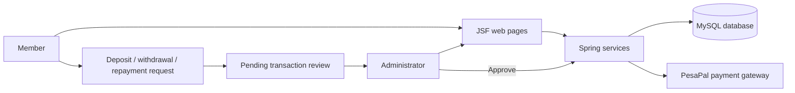
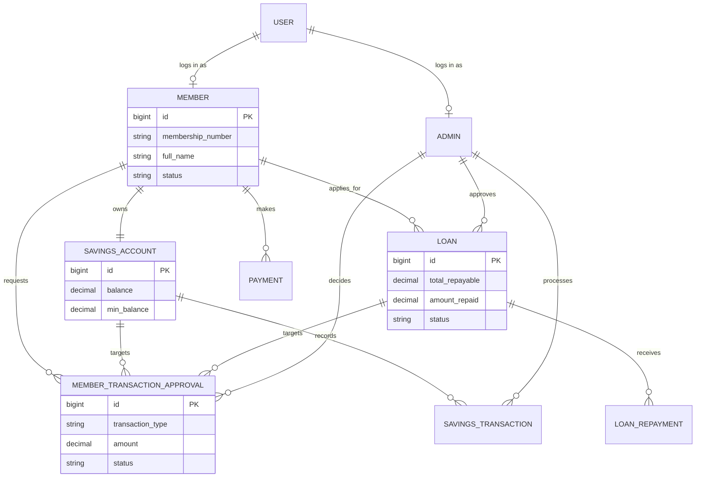

# Kimwanyi SACCO

Kimwanyi SACCO is a Java web application for managing members, savings accounts, loans, repayments, and administrator approvals. It uses Spring, JSF, Hibernate/JPA, MySQL, and embedded Tomcat through Cargo.

## Main features

- Member registration and secure role-based access for members and administrators
- Savings deposits and withdrawals with minimum-balance protection
- Loan applications, approval, repayment, and overdue-loan tracking
- Member transaction requests that require admin approval before balances change
- Mobile Money/Card payment integration through PesaPal

## How it fits together



## Data model

The complete source diagram is available in [erd.pdf](erd.pdf). The simplified ERD below highlights the main relationships.



## Run locally

### Prerequisites

- Java 17
- Maven 3.8 or newer
- MySQL 8

### 1. Configure environment values

Create a `.env` file in the project root. It must provide the values referenced by `src/main/resources/application.properties`:

```env
DB_URL=jdbc:mysql://localhost:3306/kimwanyi_sacco
DB_USERNAME=root
DB_PASSWORD=your_password

PESAPAL_CONSUMER_KEY=your_key
PESAPAL_CONSUMER_SECRET=your_secret
PESAPAL_BASE_URL=https://pay.pesapal.com/v3
PESAPAL_CALLBACK_URL=http://localhost:8080/KimwanyiSacco/paymentCallback.xhtml
PESAPAL_IPN_URL=http://localhost:8080/KimwanyiSacco/api/v1/payments/ipn
PAYMENT_CURRENCY=UGX
BUSINESS_NAME=Kimwanyi SACCO
```

Create the database first if it does not already exist:

```sql
CREATE DATABASE kimwanyi_sacco;
```

Hibernate is configured with `hibernate.hbm2ddl.auto=update`, so it creates or updates the application tables when the project starts.

### 2. Build and start

From the project root, run:

```bash
mvn clean package cargo:run
```

Then open the deployed Kimwanyi SACCO application in your browser (normally `http://localhost:8080/KimwanyiSacco/`).

To stop the embedded Tomcat server, press `Ctrl+C` in the terminal.

## Developer notes

- Keep financial updates inside the service layer; this preserves authorization, validation, audit records, and transaction boundaries.
- Member dashboard transaction requests remain `PENDING` until an administrator approves them in **Transaction Review**. Rejecting a request does not alter the savings or loan balance.
- Deposits and withdrawals are recorded as `SavingsTransaction` entries. Loan repayments are recorded as `LoanRepayment` entries.
- Avoid committing real `.env` credentials. Use local or test PesaPal credentials during development.

## Project structure

```text
src/main/java/com/kimwanyisacco/
  controller/    REST endpoints
  service/       business rules and transactions
  model/         JPA entities and enums
  repository/    database access
  web/           JSF backing beans
src/main/webapp/
  admin/         administrator pages
  member/        member pages
```
